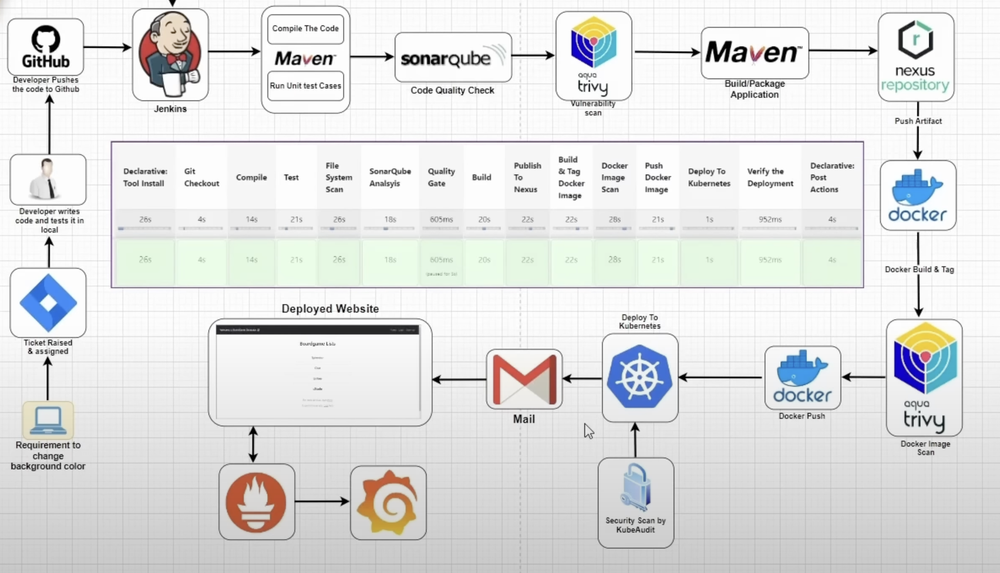

# corporate-devops-project

This project is to demonstrate how we practice DevOps at the corporate level by implementing Kubernetes Orchestration, seamless CI/CD pipelines using Jenkins, Monitoring servers(Grafana &BlackBox) and etc

